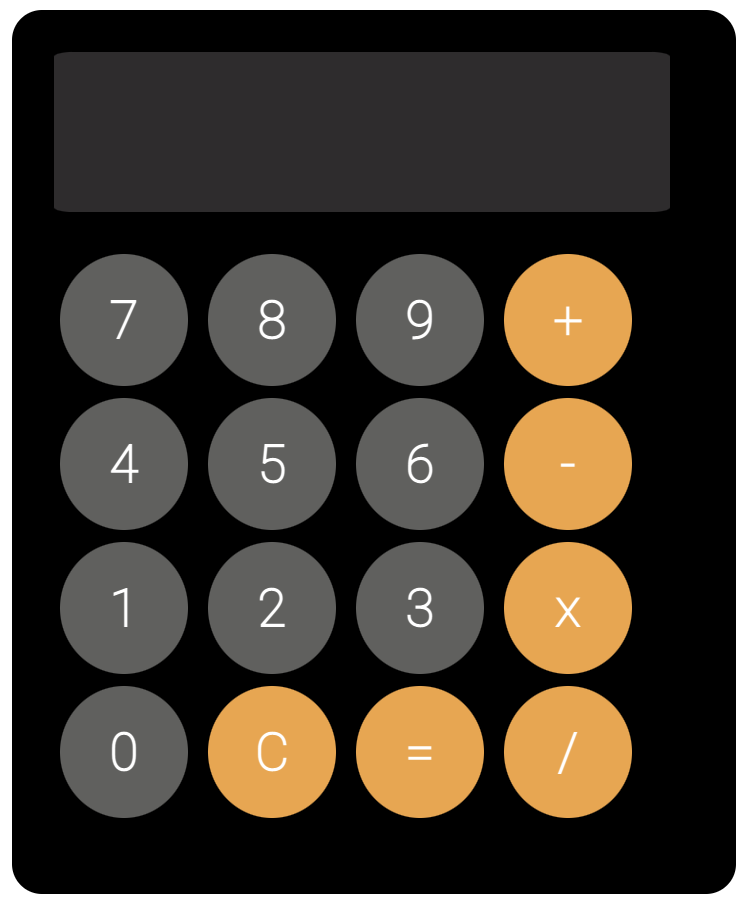
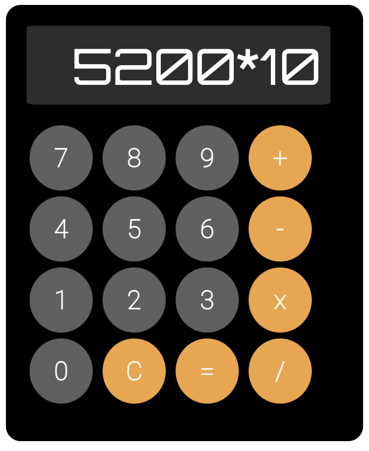
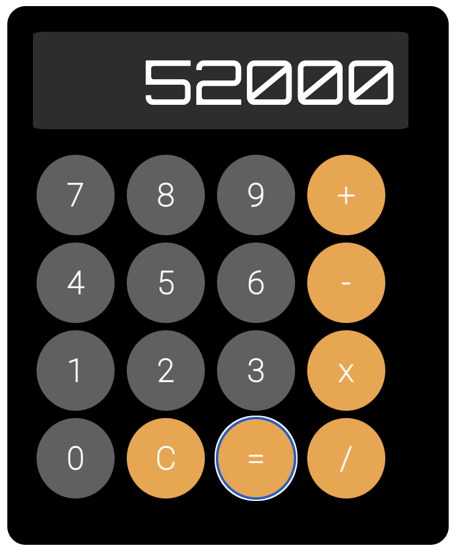
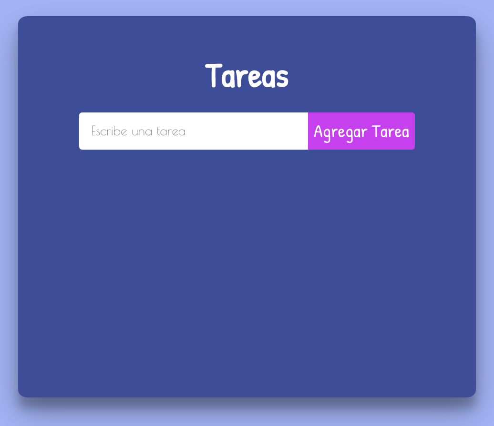
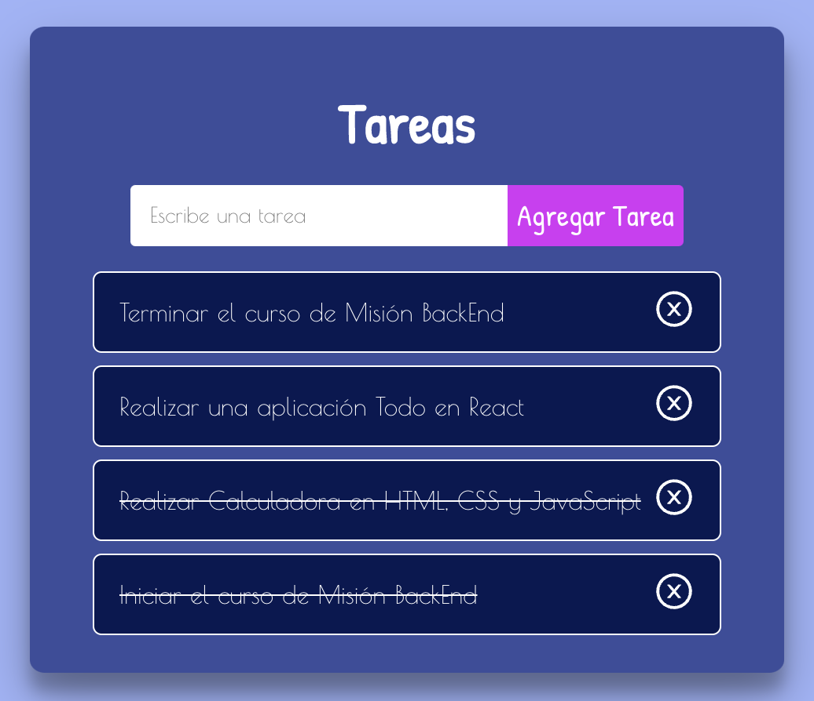
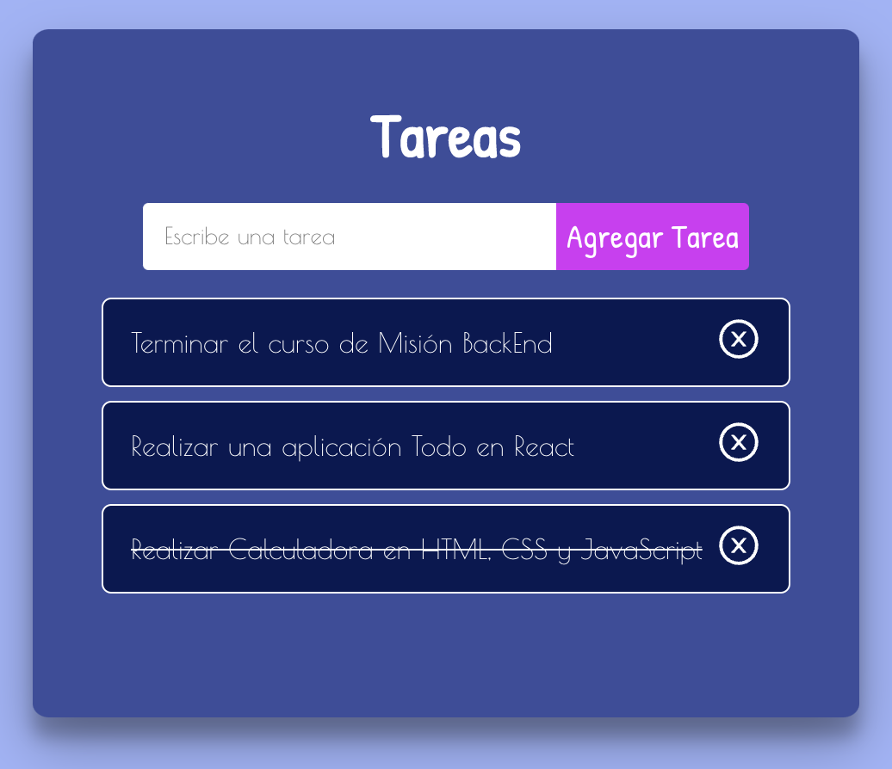

# MisionBackend

## Calculadora Básica
El primer proyecto es una calculadora básica utilizando HTML, CSS y Javascript.
[calculadora]("calculadora)

 

 

## Todo App
El segundo proyecto es una aplicación de tareas utilizando React y Hooks.

 

 

